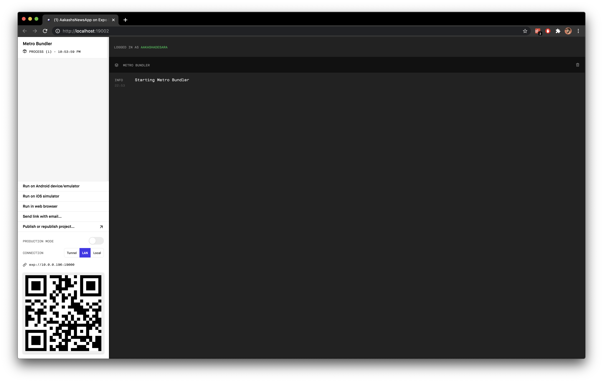
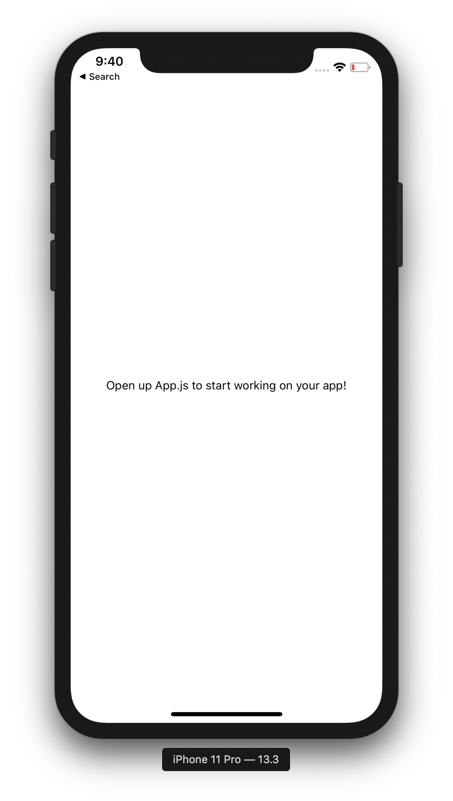

# 🐮 React Native Tutorial - NewsApp

This is React Native programming tutorial originally created for a HackDavis '21 workshop but put into a readme for other new developers to learn from.

As you are reading through this tutorial, if you find any part which is confusing, come across a typo, or have any recommendations for improvements, feel free to shoot me a DM on [Twitter](https://twitter.com/aakashadesara) or better yet, make a Pull Request.

Anyhow, let's get hacking! This is a follow-along tutorial so I recommend you bust out your favorite code editor and code alongside while reading through this.

### 😎 What are we building?

By the end of this tutorial, you will have a fully functional mobile application which can run on Android, iOS, and web. It will be built entirely with React Native (Javascript) utilizing the Expo utility and powered by [lil.software's NewsAPI](https://lil.software/api/). You will understand the basic concepts that power React development (components, state, props, etc) and will be comfortable enough to continue exploring the beautiful world of React development going forward.

Here is what your app will look like by the end of this tutorial:


### 🔍 What is React Native?

According to [Google](https://www.google.com/search?q=what+is+react+native&rlz=1C5CHFA_enUS883US884&oq=what+is+react+native&aqs=chrome.0.0i457j0j0i20i263j0l2j0i395l5.1527j1j4&sourceid=chrome&ie=UTF-8), "React Native is an open-source mobile application framework created by Facebook, Inc. It is used to develop applications for Android, Android TV, iOS, macOS, tvOS, Web, Windows and UWP by enabling developers to use React's framework along with native platform capabilities.

React Native is a technology used by a lot of notable companies like Lyft, Nextdoor, Airbnb, Discord, Instagram, and many others. It's a great utility and worth learning.

**tl;dr** is, you can write code once in JavaScript, it will compile into a bunch of platforms that folks use today.

### ⚙️ Let's get Set Up

⭐️ Before we do any coding, you'll need to install some basic dependencies to get started with React Native development. Make sure to do all of these:

1. Install Node.js / NPM on your machine - [Download Link](https://nodejs.org/en/download/)
2. Install Expo by calling this command in your Terminal:

```bash
# Install command line tools
npm install --global expo-cli
```

3. Depending on how you want to test your app, you will need some additional software:
   - iPhone / iPad = Download [Xcode](https://developer.apple.com/xcode/) and set up emulator
   - Android = Download [Android Studio](https://www.google.com/search?q=android+studio&rlz=1C5CHFA_enUS883US884&oq=Android+Studio&aqs=chrome.0.0i67i433i457j0i67i395i433j0i20i263i395j0i395j0i395i433j0i395l5.1307j1j4&sourceid=chrome&ie=UTF-8) and set up emulator
   - Physical Device = Download the 'Expo Client' app on your [Android](https://play.google.com/store/apps/details?id=host.exp.exponent&hl=en_US&gl=US) or [iOS](https://apps.apple.com/us/app/expo-client/id982107779) physical device.

After following those steps, you'll have all the tools necessary to get going with this tutorial.

### 🏃🏽‍♂️ Let's Get Started

⭐️ Alright, so the first step is gonna be to _create_ your React Native application. In order to do so, open a Terminal and navigate to your directory of choice. Over there, call this command:

```bash
# Create an Expo React Native app called 'NewsApp'
expo init NewsApp

# Go into the "NewsApp" project so you can start working
cd NewsApp
```

At this point, I'd recommend opening up "NewsApp" folder in your favorite code editor. My personal favorite is [VSCode](https://code.visualstudio.com/).

⭐️ Once you're in the `NewsApp` folder, you can call this easy command to boot up your Expo client:

```bash
expo start
```

And with that command, your browser will open up and you will see a nifty control board with a bunch of logs and buttons. It will look something like this:



Once this dashboard opens up, you can boot up your app in whichever device you prefer. For the sake of this demo, I clicked on `Run on iOS simulator` which opened up the app in a emulated iPhone (booted through the Xcode Simulator application).

You also have the option of booting up the app in Android simulator or, scanning the big QR code with your camera and opening up the app directly on your physical iPhone or Android phone.

This is what the app looked like when it initially booted up for me:


Pretty basic but we'll make it fancy in a bit 😎

### 😅 "Components"? What's that

So before we dive deep into development, it's imporant to understand one of the literal basic building blocks of React applications -- Components. Components are pretty much what they sound like, a piece, of an application. Developers create Components in their apps so they can re-use code, and re-use various parts of the UI (user interface) throughout the application.

There are two types of Components, `functional` components and `class` components. Both serve the same purpose but have nuances in their implementations.

Components are used in React by being called in 'tags'. If you are familiar with 'tags' from HTML, this concept is similar, but in this case, our React tags call the components, and take in 'props' (or arguments) which alter what the component looks like.

Another important point to note is that in React, we can use in-built Components that React Native supplies, import Components from other libraries, and build our own custom components.

Let's check out our first 'Component'.

⭐️ Open up the `App.js` file and you will see the following:

```javascript
import { StatusBar } from "expo-status-bar";
import React from "react";
import { StyleSheet, Text, View } from "react-native";

export default function App() {
  return (
    <View style={styles.container}>
      <Text>Open up App.js to start working on your app!</Text>
      <StatusBar style="auto" />
    </View>
  );
}

const styles = StyleSheet.create({
  container: {
    flex: 1,
    backgroundColor: "#fff",
    alignItems: "center",
    justifyContent: "center",
  },
});
```

For the sake of this tutorial, delete the contents of that file, and replace it with this:

```javascript
import { StatusBar } from "expo-status-bar";
import React, { Component } from "react";
import { StyleSheet, Text, View } from "react-native";

export default class App extends Component {
  constructor(props) {
    super(props);
  }

  render() {
    return (
      <View style={styles.container}>
        <Text>Open up App.js to start working on your app!</Text>
        <StatusBar style="auto" />
      </View>
    );
  }
}

const styles = StyleSheet.create({
  container: {
    flex: 1,
    backgroundColor: "#fff",
    alignItems: "center",
    justifyContent: "center",
  },
});
```

Let's break down what's happening here. At the very top, you see three lines that start with `import`.

```javascript
import { StatusBar } from "expo-status-bar";
import React from "react";
import { StyleSheet, Text, View } from "react-native";
```

What this means is that we are _importing_ code from pre-built JavaScript libraries and using them in this component.

The next snippet of code is the actual Component, which is named 'App'.

```javascript
export default class App extends Component {
  constructor(props) {
    super(props);
  }

  render() {
    return (
      <View style={styles.container}>
        <Text>Open up App.js to start working on your app!</Text>
        <StatusBar style="auto" />
      </View>
    );
  }
}
```

This component is a 'class' component because it is a 'class' named App and inside the Class, we have two methods, a 'render' method and 'constructor'. Render is what paints when the component is called and the Constructor is the setup method that is called right when the Component is created.

Our `render` method is returning a `<View>` which has two elements inside the View, a `<Text>` component and a `<StatusBar>` component. This is what we see on the screen when we boot up the app for the first time.

You will also notice that the view has a `style` prop which takes `styles.container`. `styles.container` is being referenced from the last bit of code which is a stylesheet that changes what the Component looks like.

```javascript
const styles = StyleSheet.create({
  container: {
    flex: 1,
    backgroundColor: "#fff",
    alignItems: "center",
    justifyContent: "center",
  },
});
```

⭐️ For our first change, try altering the text that says `Open up App.js to start working on your app!` and then shift your attention to your device which is running the app. It will have changed!

Example Change:

```javascript
  render() {
    return (
      <View style={styles.container}>
        <Text>HELLO HACK DAVIS!</Text>
        <StatusBar style="auto" />
      </View>
    );
  }
```

That's cool, but now we want to add some more useful elements to our component. In our final product, we have, in essence, two main components on the main page: a "Search Bar" and a "Scroll View" which has a list of news articles. Let's start with the Search Bar.

### 🕵🏽‍♂️ Adding A Search Bar

In order to add a Search Bar to our app, we will need to use a special React Native component called `<TextInput>`. In order to use this Component, you first need to import it.

At the top of the file, change the line that says:

```javascript
import { StyleSheet, Text, View } from "react-native";
```

to say this instead:

```javascript
import { StyleSheet, View, TextInput } from "react-native";
```

Now we have access to the `TextInput` component.

Now, we need to actually call that component and use it in our
