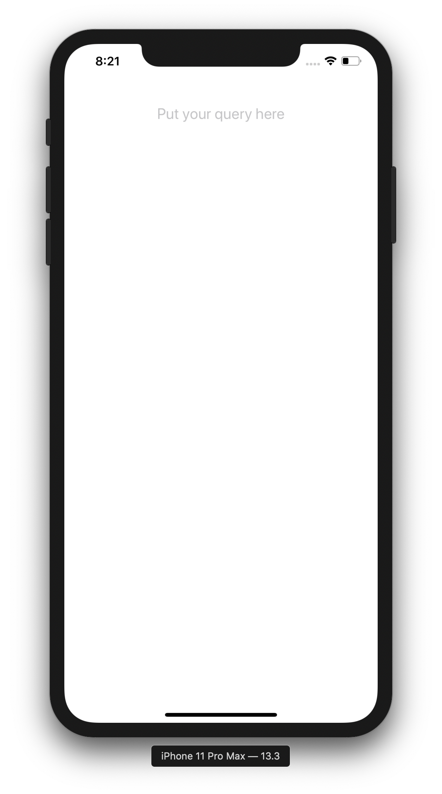

# 🐮 React Native Tutorial - NewsApp

This is React Native programming tutorial originally created for a HackDavis '21 workshop but put into a readme for other new developers to learn from.

As you are reading through this tutorial, if you find any part which is confusing, come across a typo, or have any recommendations for improvements, feel free to shoot me a DM on [Twitter](https://twitter.com/aakashadesara) or better yet, make a Pull Request.

Anyhow, let's get hacking! This is a follow-along tutorial so I recommend you bust out your favorite code editor and code alongside while reading through this.

## 😎 What are we building?

By the end of this tutorial, you will have a fully functional mobile application which can run on Android, iOS, and web. It will be built entirely with React Native (Javascript) utilizing the Expo utility and powered by [lil.software's NewsAPI](https://lil.software/api/). You will understand the basic concepts that power React development (components, state, props, etc) and will be comfortable enough to continue exploring the beautiful world of React development going forward.

Here is what your app will look like by the end of this tutorial:


## 🔍 What is React Native?

According to [Google](https://www.google.com/search?q=what+is+react+native&rlz=1C5CHFA_enUS883US884&oq=what+is+react+native&aqs=chrome.0.0i457j0j0i20i263j0l2j0i395l5.1527j1j4&sourceid=chrome&ie=UTF-8), "React Native is an open-source mobile application framework created by Facebook, Inc. It is used to develop applications for Android, Android TV, iOS, macOS, tvOS, Web, Windows and UWP by enabling developers to use React's framework along with native platform capabilities.

React Native is a technology used by a lot of notable companies like Lyft, Nextdoor, Airbnb, Discord, Instagram, and many others. It's a great utility and worth learning.

**tl;dr** is, you can write code once in JavaScript, it will compile into a bunch of platforms that folks use today.

## ⚙️ Let's get Set Up

⭐️ Before we do any coding, you'll need to install some basic dependencies to get started with React Native development. Make sure to do all of these:

1. Install Node.js / NPM on your machine - [Download Link](https://nodejs.org/en/download/)
2. Install Expo by calling this command in your Terminal:

```bash
# Install command line tools
npm install --global expo-cli
```

3. Depending on how you want to test your app, you will need some additional software:
   - iPhone / iPad = Download [Xcode](https://developer.apple.com/xcode/) and set up emulator
   - Android = Download [Android Studio](https://www.google.com/search?q=android+studio&rlz=1C5CHFA_enUS883US884&oq=Android+Studio&aqs=chrome.0.0i67i433i457j0i67i395i433j0i20i263i395j0i395j0i395i433j0i395l5.1307j1j4&sourceid=chrome&ie=UTF-8) and set up emulator
   - Physical Device = Download the 'Expo Client' app on your [Android](https://play.google.com/store/apps/details?id=host.exp.exponent&hl=en_US&gl=US) or [iOS](https://apps.apple.com/us/app/expo-client/id982107779) physical device.

After following those steps, you'll have all the tools necessary to get going with this tutorial.

## 🏃🏽‍♂️ Let's Get Started

⭐️ Alright, so the first step is gonna be to _create_ your React Native application. In order to do so, open a Terminal and navigate to your directory of choice. Over there, call this command:

```bash
# Create an Expo React Native app called 'NewsApp'
expo init NewsApp

# Go into the "NewsApp" project so you can start working
cd NewsApp
```

At this point, I'd recommend opening up "NewsApp" folder in your favorite code editor. My personal favorite is [VSCode](https://code.visualstudio.com/).

⭐️ Once you're in the `NewsApp` folder, you can call this easy command to boot up your Expo client:

```bash
expo start
```

And with that command, your browser will open up and you will see a nifty control board with a bunch of logs and buttons. It will look something like this:


Once this dashboard opens up, you can boot up your app in whichever device you prefer. For the sake of this demo, I clicked on `Run on iOS simulator` which opened up the app in a emulated iPhone (booted through the Xcode Simulator application).

You also have the option of booting up the app in Android simulator or, scanning the big QR code with your camera and opening up the app directly on your physical iPhone or Android phone.

This is what the app looked like when it initially booted up for me:


Pretty basic but we'll make it fancy in a bit 😎

## 😅 "Components"? What's that

So before we dive deep into development, it's imporant to understand one of the literal basic building blocks of React applications -- Components. Components are pretty much what they sound like, a piece, of an application. Developers create Components in their apps so they can re-use code, and re-use various parts of the UI (user interface) throughout the application.

There are two types of Components, `functional` components and `class` components. Both serve the same purpose but have nuances in their implementations.

Components are used in React by being called in 'tags'. If you are familiar with 'tags' from HTML, this concept is similar, but in this case, our React tags call the components, and take in 'props' (or arguments) which alter what the component looks like.

Another important point to note is that in React, we can use in-built Components that React Native supplies, import Components from other libraries, and build our own custom components.

Let's check out our first 'Component'.

⭐️ Open up the `App.js` file and you will see the following:

```javascript
import { StatusBar } from "expo-status-bar";
import React from "react";
import { StyleSheet, Text, View } from "react-native";

export default function App() {
  return (
    <View style={styles.container}>
      <Text>Open up App.js to start working on your app!</Text>
      <StatusBar style="auto" />
    </View>
  );
}

const styles = StyleSheet.create({
  container: {
    flex: 1,
    backgroundColor: "#fff",
    alignItems: "center",
    justifyContent: "center",
  },
});
```

For the sake of this tutorial, delete the contents of that file, and replace it with this:

```javascript
import { StatusBar } from "expo-status-bar";
import React, { Component } from "react";
import { StyleSheet, Text, View } from "react-native";

export default class App extends Component {
  constructor(props) {
    super(props);
  }

  render() {
    return (
      <View style={styles.container}>
        <Text>Open up App.js to start working on your app!</Text>
        <StatusBar style="auto" />
      </View>
    );
  }
}

const styles = StyleSheet.create({
  container: {
    flex: 1,
    backgroundColor: "#fff",
    alignItems: "center",
    justifyContent: "center",
  },
});
```

Let's break down what's happening here. At the very top, you see three lines that start with `import`.

```javascript
import { StatusBar } from "expo-status-bar";
import React from "react";
import { StyleSheet, Text, View } from "react-native";
```

What this means is that we are _importing_ code from pre-built JavaScript libraries and using them in this component.

The next snippet of code is the actual Component, which is named 'App'.

```javascript
export default class App extends Component {
  constructor(props) {
    super(props);
  }

  render() {
    return (
      <View style={styles.container}>
        <Text>Open up App.js to start working on your app!</Text>
        <StatusBar style="auto" />
      </View>
    );
  }
}
```

This component is a 'class' component because it is a 'class' named App and inside the Class, we have two methods, a 'render' method and 'constructor'. Render is what paints when the component is called and the Constructor is the setup method that is called right when the Component is created.

Our `render` method is returning a `<View>` which has two elements inside the View, a `<Text>` component and a `<StatusBar>` component. This is what we see on the screen when we boot up the app for the first time.

You will also notice that the view has a `style` prop which takes `styles.container`. `styles.container` is being referenced from the last bit of code which is a stylesheet that changes what the Component looks like.

```javascript
const styles = StyleSheet.create({
  container: {
    flex: 1,
    backgroundColor: "#fff",
    alignItems: "center",
    marginTop: 80,
  },
  newsContainer: {
    width: "100%",
    backgroundColor: "#EEE",
  },
});
```

⭐️ For our first change, try altering the text that says `Open up App.js to start working on your app!` and then shift your attention to your device which is running the app. It will have changed!

Example Change:

```javascript
  render() {
    return (
      <View style={styles.container}>
        <Text>HELLO HACK DAVIS!</Text>
        <StatusBar style="auto" />
      </View>
    );
  }
```

That's cool, but now we want to add some more useful elements to our component. In our final product, we have, in essence, two main components on the main page: a "Search Bar" and a "Scroll View" which has a list of news articles. Let's start with the Search Bar.

## 🕵🏽‍♂️ Adding A Search Bar

In order to add a Search Bar to our app, we will need to use a special React Native component called `<TextInput>`. In order to use this Component, you first need to import it.

At the top of the file, change the line that says:

```javascript
import { StyleSheet, Text, View } from "react-native";
```

to say this instead:

```javascript
import { StyleSheet, View, TextInput } from "react-native";
```

Now we have access to the `TextInput` component.

Now, we need to actually call that component and use it in our our App 'class` component. In order to do so, change the render method of our App component to look like so:

```javascript
    render() {
        return (
            <View style={styles.container}>
                <TextInput
                    placeholder="Put your query here"
                    onChangeText={(text) => {}}
                    style={{ fontSize: 20, marginBottom: 24 }}
                    />
            </View>
        );
    }
```

What you did here was create an input field where the user can type stuff. The `placeholder` property is the gray text that appears when the text input field is empty. The `onChangeText` property is a function which is called every time the text input is updated. The `style` property is an argument where you can input a "style"-object (with CSS key-value pairs) that you can apply to the input so it looks how you want it to look.



## 📰 Making a News Feed

Next up, we're gonna make a news feed with some fake data. The first thing you'll need is, some fake data. Go ahead and copy this snippet of code into your `App.js` file right below your import statements at the top of the file:

```javascript
const FAKE_NEWS_CONTENT = [
  {
    title: "Aliens Invade Earth",
    description:
      "4,300 space ships enter Earths ozone layer and invade the planet.",
    image:
      "https://images.unsplash.com/photo-1495726569656-8b8886143e6a?ixid=MXwxMjA3fDB8MHxwaG90by1wYWdlfHx8fGVufDB8fHw%3D&ixlib=rb-1.2.1&auto=format&fit=crop&w=2514&q=80",
    url: "www.google.com",
  },
  {
    title: "Apple Buys Microsoft",
    description:
      "Largest company in the world buys second largest company for $3",
    image:
      "https://images.unsplash.com/photo-1552255349-450c59a5ec8e?ixid=MXwxMjA3fDB8MHxwaG90by1wYWdlfHx8fGVufDB8fHw%3D&ixlib=rb-1.2.1&auto=format&fit=crop&w=2551&q=80",
    url: "www.google.com",
  },
  {
    title: "Elon Musk Invents New Species",
    description:
      "Genius philanthropist Elon Musk creates a new species of humanoid creatures",
    image:
      "https://images.unsplash.com/photo-1540573133985-87b6da6d54a9?ixlib=rb-1.2.1&ixid=MXwxMjA3fDB8MHxwaG90by1wYWdlfHx8fGVufDB8fHw%3D&auto=format&fit=crop&w=2555&q=80",
    url: "www.google.com",
  },
];
```

In this case, `FAKE_NEWS_CONTENT`, is an array of javascript objects. Each object has four attributes: `title`, `description`, `image`, and `url`. We are going to use this data to visualize ours news feed while hacking but, later on in this tutorial you will link it up with actual data from an [API](https://www.mulesoft.com/resources/api/what-is-an-api#:~:text=API%20is%20the%20acronym%20for,you're%20using%20an%20API.) ... more on that later.

After adding in the `FAKE_NEWS_CONTENT` data, you will need to set the state of our App component so it knows what news to render -- which in this case is the `FAKE_NEWS_CONTENT`. Go ahead and update the constructor of your App class to say the following:

```javascript
constructor(props) {
    super(props);

    this.state = {
      news: FAKE_NEWS_CONTENT
      search: "",
    };
  }

```

After updating the `news` state, you will need to import an important component to make a newsfeed: `ScrollView`. Change the line that says:

```javascript
import { StyleSheet, Text, View } from "react-native";
```

to say this instead:

```javascript
import { StyleSheet, View, TextInput, ScrollView } from "react-native";
```

After importing `ScrollView` module, go ahead and update the render method of your App class component so you call ScrollView.

```javascript
render() {
    return (
      <View style={styles.container}>
        <TextInput
          placeholder="Put your query here"
          onChangeText={(text) => this.updateSearch(text)}
          style={{ fontSize: 20, marginBottom: 24 }}
        />

        <ScrollView style={styles.newsContainer}>

        </ScrollView>
      </View>
    );
  }
```

What we did here was create a ScrollView which can hold a bunch of 'children' classes. The cool thing about a ScrollView is that, if there is 'overflow' (or content that goes past the edge of the screen), the user will be able to scroll and see the additional content.

Now, let's loop through the data and make it print something. You can use the `.map()` javascript function to loop through an array and do something on each entry. In our case, we want to loop through the Array and, return one "News Item" per element in our array. At the moment, we don't have a "News Item" class so let's just print the titles.

Change your code to say the following:

```javascript
render() {
    return (
      <View style={styles.container}>
        <TextInput
          placeholder="Put your query here"
          onChangeText={(text) => this.updateSearch(text)}
          style={{ fontSize: 20, marginBottom: 24 }}
        />

        <ScrollView style={styles.newsContainer}>
          {this.state.news.map((data) => {
            return <Text>{data.title}</Text>;
          })}
        </ScrollView>
      </View>
    );
  }
```

What we are doing here is looping through the `this.state.news` array (which, if you recall, is a list of our `FAKE_NEWS_CONTENT`), and for every element in that array, we are returning a `<Text>` element with the title in it.

Your app should look like this:


## ✌️ Making a News Item Component

Cool, so now we have the titles rendering but we want to render more -- we want the image, title, subtitle, AND url. We could put all the code for rendering that into the place where we said ` <Text>{data.title}</Text>;` but that would lead to a really long App component. Instead, we should create a new component in a new file called `NewsItem.js`.

Go ahead and create a new file called `NewsItem.js` and copy this code into there:

```javascript
import React from "react";
import { Text, View, Image, Button, Linking } from "react-native";

export function NewsItem(props) {
  return <>// content goes here</>;
}
```

As you can see, there are some interesting things happening in this boilerplate. A couple things to notice

- We imported `import React from "react";`. Always import `React` when making a new component.
- We imported 5 classes: `{Text, View, Image, Button, Linking }`. `Text` is how we render our title and subtitle. `View` is how we organize all our elements. `Image` is how we load in the article's image. `Button` is how we make something for the user to click to go to the original article. `Linking` is a library that opens up the user's default browser if given a URL.
- We made a different type of component -- a 'functional' component. This component is called `NewsItem` which takes one parameter, `props`.

**Sidenote: What is a Prop?**
I talked about this earlier, but a prop is short for property. In react, props are how we pass around arguments to customize components. For example, if I called the Button component like so:

```javascript
<Button title="Aakash is coding">
```

The Button component has a prop name "title". I can access this prop by saying `props.title` inside the Button component code.

--
So considering that we access to the `props` attribute in our NewsItem component, we can use attributes that we pass in. In our case, we plan on using NewsItem like so:

```javascript
<NewsItem
  title={"title goes here"}
  description={"description of event!"}
  image={"image url"}
  url={"link to the article"}
/>
```

So we have four props, `title`, `description`, `image`, and `url`. In our NewsItem class, go ahead and update the function so it looks like so:

```javascript
export function NewsItem(props) {
  const title = props.title;
  const description = props.description;
  const image = props.image;
  const url = props.url;

  return (
    <>
      <View style={{ padding: 16 }}>
        <Image source={{ uri: image }} style={{ height: 200 }}></Image>
        <Text style={{ paddingTop: 16, fontSize: 24, fontWeight: "bold" }}>
          {title}
        </Text>
        <Text>{description}</Text>
        <Button
          title={"Read the article"}
          onClick={() => {
            // Linking is a React Native module which opens up a url in the
            //      user's default browser
            Linking.openURL(url);
          }}
        ></Button>
        <View
          style={{
            height: 1,
            backgroundColor: "#CCC",
            marginTop: 24,
            marginBottom: 24,
          }}
        ></View>
      </View>
    </>
  );
}
```

A lot of this syntax should feel familiar to what we've done before (i.e View, Text, etc).

In this snippet:

```javascript
<Button
  title={"Read the article"}
  onClick={() => {
    Linking.openURL(url);
  }}
></Button>
```

We are making a "Button" that has the title "Read the article", and when you click on the button, it will call an anonymous function which uses the `Linking` library to open a url.

Now we have a NewsItem component!

## 🥁 Using the NewsItem Component

Now that we have the NewsItem functional component, we want to use it. In your `App.js` file, import the `NewsItem` class at the top by saying:

```javascript
import { NewsItem } from "./NewsItem.js";
```

and then, change the line that says

```javascript
return <Text>{data.title}</Text>;
```

to say this instead:

```javascript
return (
  <NewsItem
    title={data.title}
    description={data.description}
    image={data.image}
    url={data.url}
  />
);
```

Refresh the page and it should look like this:


### ☁️ Calling the News API for Real News

Now that we have the articles rendering using the `NewsItem` component in a scrollview, lets try to fill our news feed with _real_ news. For this, we will be hitting [lil.software's News API](https://lil.software/api/).

In App.js, add a Lifecycle Method called `componentDidMount()` to your `App` class component.

```javascript
componentDidMount() {
    fetch("https://api.lil.software/news")
      .then((j) => {
        return j.json();
      })
      .then((res) => {
        this.setState({
          news: res["articles"],
        });
      });
  }
```

In React, we have these special methods that can be used in Class Components called 'Lifecycle Methods' -- methods that are run when the component mounts, unmounts, or does other special component behavior. In our case, we want to call our NewsAPI right when the component mounts which is why we added our API code to the `componentDidMount()` method.

The way we hit the API is by calling the Javascript `fetch` method with the API url. We then use the returned promise and turn it into a json value which is further passed into another .then statement that ultimately gets saved in the state of the component (overriding the `news` part of the state).

[ I know this sounds complex and but here is a resource that will explain what an [API](https://www.youtube.com/watch?v=s7wmiS2mSXY&ab_channel=MuleSoftVideos) is and here is another resource that explains what a '[Promise](https://developer.mozilla.org/en-US/docs/Web/JavaScript/Reference/Global_Objects/Promise)' is in Javascript ]

After adding this `componentDidMount()` method, we will have a fully rendering News App!


## 🕵🏽‍♂️ Adding Search Functionality

Now that our News is rendering, lets add in a way to filter our articles based on a query. In App.js, update your `<TextInput>` to reflect this change:

```javascript
<TextInput
  placeholder="Put your query here"
  onChangeText={(text) => this.updateSearch(text)}
  style={{ fontSize: 20, marginBottom: 24 }}
/>
```

and make a new method above the render method called `updateSearch`

```javascript
updateSearch = (text) => {
  this.setState({
    search: text,
  });
};
```

What happens here is that the `TextInput` will now call `updateSearch` every time we type text into `TextInput` and `updateSearch` will then update the state so it saves our query in the Component's state.

Finally, update your `ScrollView` so it looks like this:

```javascript
<ScrollView style={styles.newsContainer}>
  {this.state.news.map((data) => {
    if (!data.title.includes(this.state.search)) {
      return null;
    }

    return (
      <NewsItem
        title={data.title}
        description={data.description}
        image={data.image}
        url={data.url}
      />
    );
  })}
</ScrollView>
```

The main change here are these three lines:

```javascript
if (!data.title.includes(this.state.search)) {
  return null;
}
```

What this is saying is that if the articles title does not include the search query, then returning `null` or an empty element.

The ultimate effect will be that only text that we query for will show up in the feed.


### 🎉 Wrapping Up

And with that final step, you are done with this News App! You've learned about how to build Class + Function components, managing components with states + props, calling an API, Lifecycle methods, CSS, modules, and more.

If you want to continue exploring React Native, I recommend checking out these links:

1. React Native Documentation - [link](https://reactnative.dev/docs/getting-started)
2. Core Components & APIs - [link](https://reactnative.dev/docs/components-and-apis)
3. Introduction to Expo - [link](https://docs.expo.io/)

Congratulations on finishing this tutorial -- I hope you continue exploring React Native.

--

_Feel free to DM me on [Twitter](https://twitter.com/aakashadesara) if you have any questions or recommendations. Also, make a Pull Request if you'd like to edit this tutorial._

_Cheers!_ ✌️
